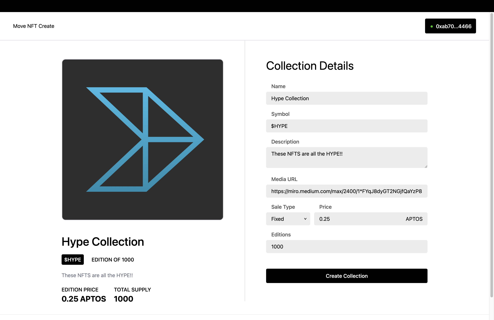

# Deploying an NFT collection on Aptos



This is a technical write-up of the system we built for developers to launch their NFT collections on Aptos. We provide details on
- the inspiration for the project
- the move modules for our escrow-less marketplace
- code snippets for creating a token using the aptos standard library
- extra features to compliment this codebase

## Project overview
At Hypotenuse Labs, we like building apps on the latest tech. So, when a new L1 (new blockchain) launches, we test it out.

Aptos is a new layer 1 blockchain that offers new features as differentiators. From consensus to smart contract design - building on Aptos is a different experience from building on Ethereum or Solana.

For more developing on Aptos, check out [their docs](https://aptosfoundation.org/developer-resources).

The goal of this project was to build and open-source something modular; something that other developers can find benefit from and extend. 

NFTs were a break-out use case in 2021. Although they were mainly for speculation, our thesis is that everything online that can be an NFT will be an NFT.

What if we could give developers building on Aptos a framework and supporting tools to build NFT projects? For example:
- Fully tested Move modules for creating and listing NFT collections
- A custom indexer
- And a front-end template to work off of

Devs can take advantage of the features enabled by Aptos & the Move language to build experiences that were previously impossible on other chains!

### Move repo: https://github.com/hyplabs/move-nft-framework
### Nextjs repo: https://github.com/hyplabs/move-nft-create
### Demo: https://drive.google.com/file/d/1bI1sh-yPSsZy4mzW5J_75bYCUjqPyEqQ/view?usp=share_link

## Move modules
The Aptos core developers laid out the standard for tokens that are non-fungible, and it can be found in the [aptos-core standard library](https://github.com/aptos-labs/aptos-core/blob/main/aptos-move/framework/aptos-token/sources/token.move).

The modules that we developed use this token standard, with extra functionality to create collections of NFTs list them for sale - via direct listings, auctions, etc.

### Escrow-less marketplaces

We've seen many marketplaces that use escrow to store NFTs that were listed. 

But when someone lists their NFT for sale (auction or fixed price), they lose ownership of the NFT as it is transferred to the marketplace's smart contract (escrow).

Since the NFT doesn't show up in the owner's wallet, the owner can't benefit from the NFTs' utility. Moreover, the NFT can only be listed/escrowed in one marketplace contract.

In contrast, an escrow-less contract has the authority to transfer the NFT from the seller. This allows the contract to execute the transfer when the sale is complete.

Thus, the seller would still own the NFT until there's a buyer! An added bonus is that the same NFT can be listed on multiple marketplaces that use this escrow-less pattern.

Let's look at the function which showcases this.
```
public entry fun initialize_auction<CoinType>(sender: &signer, creator: address, collection_name: vector<u8>, token_name: vector<u8>, min_selling_price: u64, duration: u64, property_version: u64) acquires AuctionItem, AuctionEvents {
    let sender_addr = signer::address_of(sender);
    let token_id = token::create_token_id_raw(creator, string::utf8(collection_name), string::utf8(token_name), property_version);

    // Check if the seller actually owns the NFT
    assert!(token::balance_of(sender_addr, token_id) > 0, ESELLER_DOESNT_OWN_TOKEN);

    let start_time = timestamp::now_microseconds();
    let end_time = duration + start_time;

    // Creating a Coin<CoinType> with zero value which would be increased when someone bids
    let zero_coin = coin::zero<CoinType>();
    let withdrawCapability = token::create_withdraw_capability(sender, token_id, 1, end_time + 1000000);
    let item = Item{
        min_selling_price,
        end_time,
        start_time,
        current_bid: zero_coin,
        current_bidder: sender_addr,
        token: token_id,
        withdrawCapability
    };

    ...
}
```				

In the above example, we don't extract the token from the seller's account. We just acquire the withdraw capability and store it in the resource. 

The withdraw capability is used when the auction is completed (in the current scenario) and the buyer has transferred the amount. 

The amount is transferred to the seller and the token is transferred from the seller to buyer (without the seller's signature since they have already given the withdraw capability). 

The `create_withdraw_capability` takes the token owner's signature, token id, quantity and the time until the withdraw capability is active. The withdraw capability would expire after the specified time.

### `AuctionHouse.move`

This module achieves the following:
- Seller can list their NFT by specifying the minimum bid price and gives the contract permission to transfer the token when the auction is closed.
- If a user doesn't have an NFT, they can call create a collection and mint a token, and have that listed for fixed price sale. This does it all in one go by specifying the required details.
- Users can bid on the NFT as long as the auction is active.
- The previous bid is transferred back to the previous bidder when a higher bid has taken place.
- Once the auction is closed, the seller or the buyer can call the contract and receive the token and coins respectively. Either the seller or buyer can call the `close_and_transfer` function.

### `FixedPriceSale.move`

This module achieves the following:
- Seller can list their NFT by specifying the listing price and gives the contract the permission to transfer the token for a limited period of time. This is set by the seller, which can be used to transfer to the buyer after they pay the listing price.
- If a user doesn't have an NFT, they can call create a collection and mint a token, and have that listed for fixed price sale. This does it all in one go by specifying the required details.
- The buyer can call the function and transfer the amount in listing price. If succeessful, the NFT is transferred to the buyer without needing the seller's signature.
- If the seller changes their mind, they can cancel the listing. This destroys the withdrawal permission gained by the contract.

### How to create a collection + list it

- To create a collection as well as a token, and then listing for a fixed price sale, call the following function:
```
public entry fun create_collection_token_and_list<CoinType>(
        creator: &signer,
        collection_name: vector<u8>,
        collection_description: vector<u8>,
        collection_uri: vector<u8>,
        collection_maximum: u64,
        collection_mutate_setting: vector<bool>,
        token_name: vector<u8>,
        token_description: vector<u8>,
        token_uri: vector<u8>,
        royalty_payee_address: address,
        royalty_points_denominator: u64,
        royalty_points_numerator: u64,
        token_mutate_setting: vector<bool>,
        property_keys: vector<string::String>,
        property_values: vector<vector<u8>>,
        property_types: vector<string::String>,
        list_price: u64,
        expiration_time: u64,
    ) acquires ListingItem, ListingEvents {
```
In the above function, we do the following
  - Create a collection
  ```
  token::create_collection_script(
      creator,
      string::utf8(collection_name),
      string::utf8(collection_description),
      string::utf8(collection_uri),
      collection_maximum,
      collection_mutate_setting
  );
  ```
  The `collection_mutate_setting` specifies if the collection data should be mutable or not. The `collection_mutate_setting` includes `collection_description`, `collection_uri` and `maximum tokens`.
  - Create a token
  ```
  token::create_token_script(
      creator,
      string::utf8(collection_name),
      string::utf8(token_name),
      string::utf8(token_description),
      1, // amount
      1, // maximum
      string::utf8(token_uri),
      royalty_payee_address,
      royalty_points_denominator,
      royalty_points_numerator,
      token_mutate_setting,
      property_keys,
      property_values,
      property_types
  );   
  ```
  Unlike other chains where token metadata is often stored off-chain, the metadata can be stored on chain in Aptos. The property keys, values and types specify the token metadata.
  For example, if you want to store: `gender: "male"`, the format arguments would be:
      - property_key: gender
      - property_values: male,
      - property_types: vector<u8>

    The token mutate setting includes `maximum tokens`, `uri`, `description` , `royalty` and `properties`.
  - Once the token and collection are created, the contract acquires the withdraw capability and stores it in the resource.
  ```
    let token_id = token::create_token_id_raw(creator_addr, string::utf8(collection_name), string::utf8(token_name), 0);

    assert!(!exists<ListingItem<CoinType>>(creator_addr), EITEM_ALREADY_EXISTS);

    // Check if the seller actually owns the NFT
    assert!(token::balance_of(creator_addr, token_id) > 0, ESELLER_DOESNT_OWN_TOKEN);

    let start_time = timestamp::now_microseconds();
    let end_time = expiration_time + start_time;

    let withdrawCapability = token::create_withdraw_capability(creator, token_id, 1, expiration_time);

    let item = Item {
        list_price,
        end_time,
        token: token_id,
        withdrawCapability
    };
  ```


  In our case, the module doesn't take ownership of the token; what it does instead is it gains the capability to withdraw. This allows the seller to maintain ownership of the token until someone executes the sale transaction. 
    
  The module gains the capability to withdraw the token from the seller (assuming it exists), without the seller's signature. This makes the module extremely powerful in managing deals with the best UX.

## TODOs (for anyone wishing to branch off)
The marketplace modules we developed are by no means production-ready, and anyone wishing to branch off should consider a formal audit. Moreover, there's a few features that should be considered before a production deployment.

### Custom indexer
The Aptos team provides a public indexing service for all Token and Coin module events. In order to index the custom events emitted from our marketplace modules, we should run our own indexer. 
    
That way, our front-end application can quickly query on-chain data such as live auctions, historical sales, and bids. 
    
Read more on the the Aptos [developer docs](https://aptos.dev/guides/indexing/).


### Marketplace home page
A home page that shows all the active listings, auctions, and bids is the final feature for this project to be an NFT marketplace. And although we can query the modules directly to get the current state of things, at scale we'd need to have this data indexed.

### SDK
Although anyone can build the transaction data required to create collections, bid on auction, etc - wrapping the aptos-specific logic into an SDK would make it easier for developers to build experiences on top of this. Moreover, such an SDK can also expose an interface for querying indexed event data.
    
## Contact Us

We encourage developers to look over our modules, extend them, and contribute to the repo with any of the features outlined above. 

If you have any questions, don't hesitate to reach out via email at **hello@hypotenuse.ca**, or DM @hypemanchan on Telegram.
